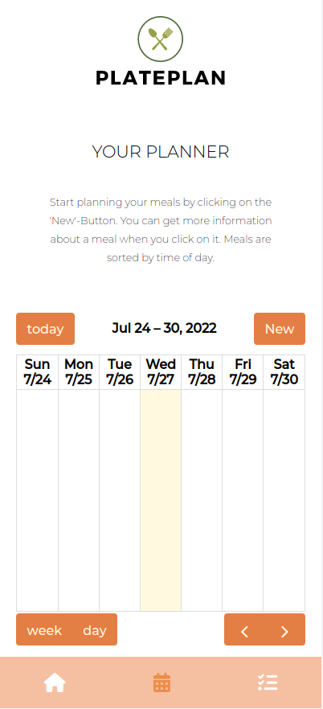

<a name="readme-top"></a>

<br />
<div align="center">
  <a href="https://github.com/lkk95/PlatePlan">
    
  </a>

<h3 align="center">PlatePlan</h3>
  <br/>
  <p align="center">
    A web app for planning your meals each day and week!
    <br />
    <br />
    <a href="https://plateplan.vercel.app/">View Demo</a>
  </p>
</div>


<details>
  <summary>Table of Contents</summary>
  <ol>
    <li>
      <a href="#about-the-project">About The Project</a>
      <ul>
        <li><a href="#built-with">Built With</a></li>
      </ul>
    </li>
    <li>
      <a href="#getting-started">Getting Started</a>
      <ul>
        <li><a href="#prerequisites">Prerequisites</a></li>
        <li><a href="#installation">Installation</a></li>
      </ul>
    </li>
    <li><a href="#usage">Usage</a></li>
    <li><a href="#contact">Contact</a></li>
    <li><a href="#acknowledgments">Acknowledgments</a></li>
  </ol>
</details>


## About The Project
<br/>
<br/>
<div align='center'></div>
<br/>
<br/>
<p>
    With PlatePlan you have a clean and beautiful meal planning app to get you started on your journey to less food waste and healthier eating habits.
You can plan your meals on the calendar and even enter additional information about the recipe. So you always have the recipe on hand and don't need to search for long.
Meals can also be edited and deleted. When you enter ingredients for a meal they will automatically be added to the shoppinglist page. That makes food shopping a lot easier and you won't forget items.
  </p>
 

<p align="right">(<a href="#readme-top">back to top</a>)</p>


### Built With

[![React][React.js]][React-url]

<p align="right">(<a href="#readme-top">back to top</a>)</p>


## Getting Started

Please check the prerequisites on your system and follow the installation instructions to run the project.

### Prerequisites

You need to install npm for using the web app. 

Follow the instructions in the npm Docs: [https://docs.npmjs.com/downloading-and-installing-node-js-and-npm](https://docs.npmjs.com/downloading-and-installing-node-js-and-npm)

### Installation

1. Clone the repo
   ```sh
   git clone https://github.com/lkk95/PlatePlan.git
   ```
3. Install NPM packages
   ```sh
   npm install
   ```
4. Install FullCalendar library and plugins.
   ```sh
   npm install --save @fullcalendar/react @fullcalendar/daygrid @fullcalendar/interaction
   ```
5. Install nanoid.
   ```sh
   npm i nanoid
   ```

<p align="right">(<a href="#readme-top">back to top</a>)</p>


## Contact

Write me a message on:

[Xing](https://www.xing.com/profile/Laura_Kesel/cv)
<br/>
[LinkedIn](https://www.linkedin.com/in/laura-kesel-985750246/)

<p align="right">(<a href="#readme-top">back to top</a>)</p>


[plateplan-screenshot]: src/imgs/screenshot_plateplan.png
[React.js]: https://img.shields.io/badge/React-20232A?style=for-the-badge&logo=react&logoColor=61DAFB
[React-url]: https://reactjs.org/
[Bootstrap.com]: https://img.shields.io/badge/Bootstrap-563D7C?style=for-the-badge&logo=bootstrap&logoColor=white
[Bootstrap-url]: https://getbootstrap.com